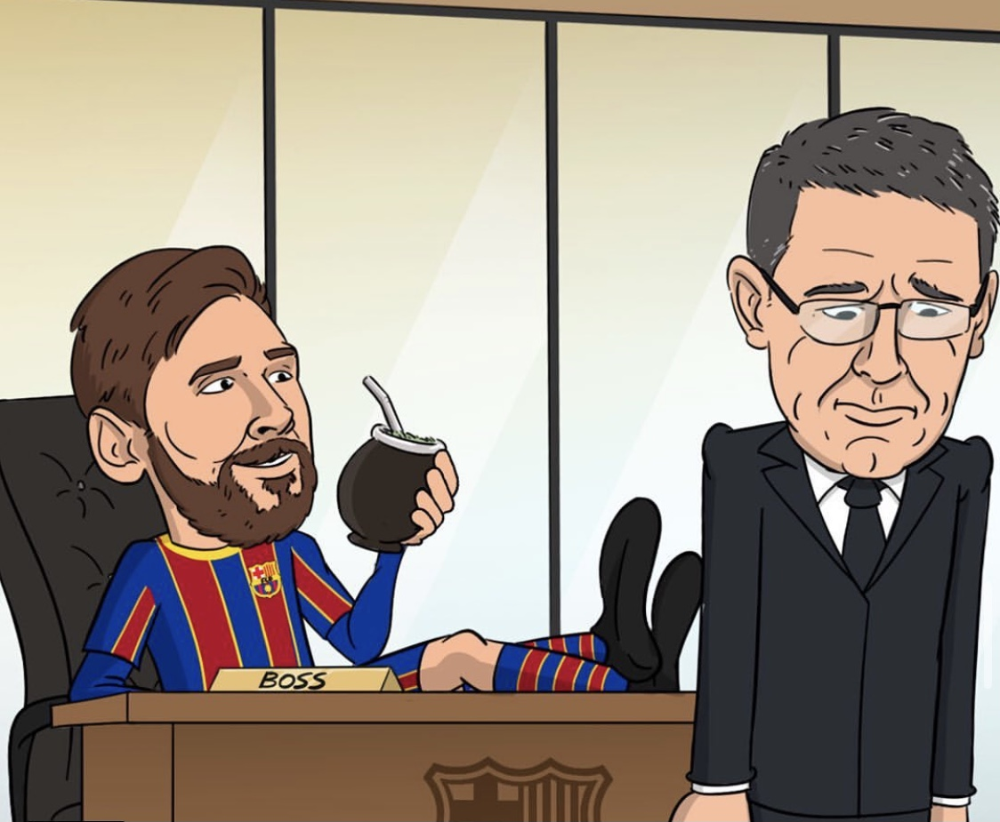

Let’s take a look at the recent El Classico match that took place that ended in a 3-1 loss at home for Barcelona for the first time since 2016. Many Madrid fans may disagree with me but the recent match was a controversial one as the penalty decision was controversial one as the recent matches show the VAR has ignored that type of fouls when it comes to a penalty decision. So where is the consistency in the VAR decision? Furthermore, Barcelona was also denied a clear penalty decision. It’s not just me but a certain number of club feeling that VAR sometimes favors Real Madrid.

The wait is finally over. I’m sure Barcelona fans all over the world woke up to this good news that the current president Bartomeu has finally resigned after the vote of no confidence was a success. He dropped a huge bombshell in his last press conference as he said Barcelona supported the idea of a super league which may replace the champions league in the future.

So who are the candidates to replace fill the void left by the current president?

1)JOAN LAPORTA is a fan favorite candidate as under his tenure Barcelona had the most success in Europe and Spain and legendary players such as Messi Xavi Iniesta and many were promoted to the first team. His main aim is to bring Pep back at the camp Nou as he believes Xavi isn’t ready to take over yet and promises the return of Neymar back the club.

2)Victor Font is by far the most active candidate and probably the one to win the upcoming elections. His ten-year project includes appointing Xavi as the manager and promoting the youngsters from La Masia to the first team and the new arrivals should be limited to only those players who will be indisputable starters at the club.

3)Another candidate is a Catalan businessman Jordi fare whose main aim is to bring the Liverpool boss Jurgen Klopp to take over at Barcelona and reveals he’s had talks with the current Liverpool boss.

4) Augusti Benedito is another another candidate for the upcoming elections. Not much is known about his campaign other than the fact that he intends to keep the current manager in charge and would’ve brought him sooner in 2015 if he had won the elections. It may come as a surprise but this candidate has the support of the ex Barca president Bartomeu

The current manager resignation means that Lionel Messi for sure now is going stay at the camp Nou and maybe even hang up his boots at his boyhood club.

Out of the candidates, the most important one in my opinion is Victor Font as he has a clear vision on what to do and that vision resembles the philosophy of Barcelona. Joan Laporta in my opinion is not a bad option too but personally, I think you only have a golden age once you can’t do that with the same tactic again as seen Pep has been struggling to win a champions league since his dismissal from Barcelona.

