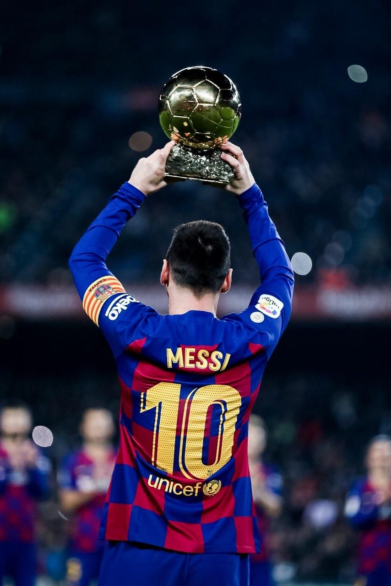
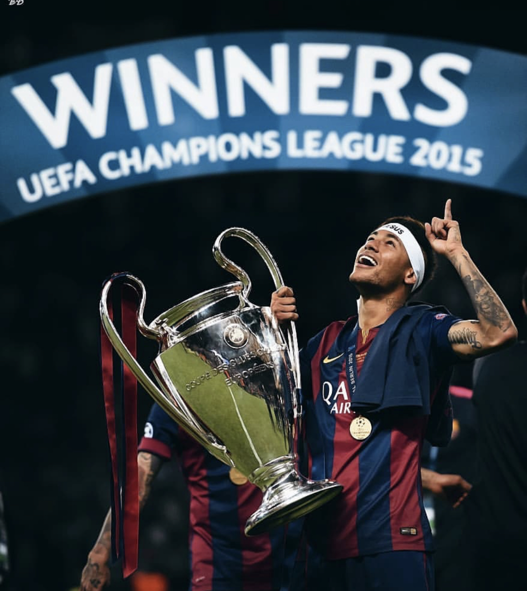
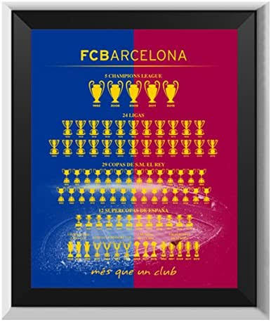

Why Messi handed in the transfer request?

It isn’t new for Barcelona fans seeing the greatest ever being linked with another club in almost every transfer window. This time the matter is a bit complicated and Barcelona may end up losing a homemade legend.

Let’s give a brief overview it is no secret that since Messi’s debut in the Barcelona jersey the club has enjoyed lots of success both domestically and in Europe. Beating Sir Alex's greatest Manchester United team twice in the champions league final by performing exceptionally in both the games and winning record Pichichi trophies by being the top goal scorer in the domestic league. Ending their rivals dominance in the domestic league the list goes on.

So the question is why did lionel Messi decide to leave the club?

For many football viewers, the decision may be due to a new challenge in his life but the reality is far from it. His decision has to do something with the hierarchy of the club. The club president was elected in the summer before the Barcelona won a historical second treble in their history and the only team who had done this twice. The club president Josep Maria Bartomeu is to be blamed for why Messi has decided to leave the club he dreamt of playing as a kid.

So how did the club’s president's action influenced the decision to leave the club?

At the beginning of this year, a rumor was circulated that the club president has hired a PR company to tarnish the reputation of the players in the Barcelona squad. And it is no news for Messi to be linked with rumors that he is the one who decides the transfer policy of the club. In January Messi and the sporting director clashed as Eric Abidal on social media stated that the players don’t work as hard under the manager and to this Messi replied that to give names of the players or improve your sporting project and Messi stated this at the beginning of the season that if Barcelona lacks a proper sporting project he will leave the club.

Recently Barcelona was knocked out of the champions league in a humiliating way and the current manager was sacked after the defeat. The new manager and the board agreed that a complete overhaul is the best option to rebuild. Lionel was annoyed the way the club officials treated his best friend Luis Suarez as he was told to leave or his contract will be terminated not to forget that Suarez is a club legend and he’s the third-best goal scorer for Barcelona. Barcelona is not known for disrespecting their club legends in that manner.

There are further blunders that may have helped him make up his mind first we will see that the current president got into a clash with club legends Xavi and Iniesta as he believed that the more they stayed at the club the more it becomes difficult for the young generation to have a breakthrough in the first team

Another reason may have been the departure of Neymar. The transfer that still haunts Barcelona to this day. It was the president who failed to persuade him to stay and ended up selling the player to PSG. Neymar after his departure stated that the Barcelona board is incompetent and the club deserves someone better however his statement wasn’t taken seriously by many Barcelona fans and I guess he was right all along. Neymar's departure was the end of the legendary MSN trio.

This could be seen also as Barcelona did not offer Dani Alves a contract extension at the club not until the club was handed a transfer ban until then it was too little too late, he was given a contract extension which allowed him to leave for free next season. He joined Juventus on a free transfer the next season being an undisputed starter their and then taking his revenge by knocking Barcelona out of the champions league in the quarter-finals. He also quoted that the administration didn't respect his contribution towards the club and he deserved a better treatment

The president assured the fans that a new deal with Messi had been signed later it was revealed that a new deal is just agreed not signed between the parties. If the contract extension had been signed this catastrophe may have been avoided.

The horrendous decisions made by the club hierarchy slowly but gradually effected his decision to send in a transfer request to leave Barcelona.

Now take a look at a little sporting side of the decision we all that Barcelona have been knocked out of the champions league in a humiliating way for the past 3 seasons. The answer is simply that the board was too late to sack the manager. Even though Barcelona had a successful domestic campaign blowing away a 3 goal in a champions league match is the end for any manager who is managing such a prestigious club but the club continued to support him. Barcelona is not a club that gives second or third chance a costly mistake and you should be out. if Valverde was to continue the Anfield debacle should've been the end still he was given another chance even Barcelona lost the Spanish cup against Valencia.

Another is the lack of a clear sporting project. Barcelona was never considered a club that used to spend high amounts of money in the transfer market. Their youth academy LA MASIA is regarded as one of the greatest academies to produce young talent. In the current president’s tenure, the academy has been completely ignored by the club as many possible prospects have left the club due to a lack of opportunities with the first team. this could be seen as limited numbers of players made their debut for Barcelona. Now that the youth was being ignored meant Barca had deviated from their main philosophy to rely on their academy to produce players meant that they had to settle with big-money signings who may not fit in the Barcelona style of play, this could be seen as the club has spent almost a billion dollar in the transfers and yet not manage to win the champions league for the last 5 years.

it was inevitable that sooner or later Messi would leave the club as many Barca fans dreamt that this would happen when the legend decided to hang up his boots to end his illustrious career at the club.

Personally for me, if Messi leaves the club he will be ungrateful for whatever the club has done for him. everybody knows that since his debut Barcelona have enjoyed a successful campaign in almost every part of football. let us not forget that at the time the youth academy was producing one of the best talents in football and to me, it was more of a team contributed success no matter how many individual awards he received because at the end of the day there is no I in a team and no player should be bigger than a club no matter how great he is.

let's take a look towards his main rival Ronaldo. this man left the best club in England to come to a struggling Real Madrid side and was dominated by their rival in every possible way in terms of individual and team success. he refused offers from Machester to stay and win with Madrid and that he did exceptionally whereas, on the other hand, Messi made his debut full of stars had a team full of potential and dominated football for over a decade and when the golden era of Barcelona is ending he wants to leave because the club is struggling to win trophies. he should stay and make the team into a dreadful force again.

IF HE LEAVES IT IS NOT A THING A CLUB LEGEND OR A CAPTAIN WOULD DO.

