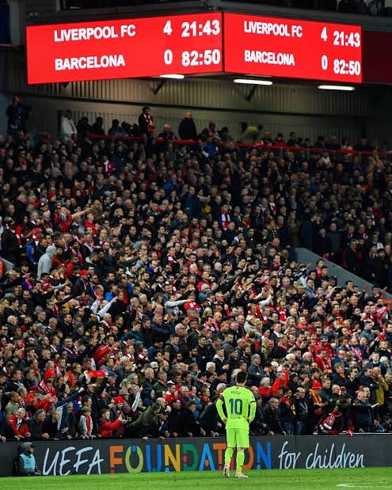

This all started three years back after Luis Enrique announced he’ll no longer coach Barcelona for the 17-18 season. A surprise appointment of Ernesto Valverde is where it all started to fall apart for Barcelona.

Previously Enrique was criticized for his style of play for abandoning the Barca DNA of a possession-based game with intense pressing to switching it to more of a counter-attacking style of play.

The first season with the new coach proved to be somewhat of a successful campaign given that the PSG was successful in luring Neymar away from Barcelona for a record fee.

The first year at the helm for Valverde wasn’t what everyone hoped for. Barcelona went unbeaten for till the last game of the Spanish league and winning the Spanish cup in an astonishing victory against Seville. Things were looking excellent for Valverde’s men. The domestic success started to hide the real problems for Barca and Roma’s comeback in the champions league was just the tip of the iceberg.

The second-year at Barca started perfectly with Barcelona being the league leaders and topping their champions league group it looked like they had come stronger this year. Thrashing Madrid in their home in the domestic league Barcelona was flying high enjoying a successful campaign. Beating Lyon and Manchester United in the Champions league now they were to face Liverpool in the semi-final of the competition. Just 3 games away from winning another historical treble things started to get worse for Barcelona. Having blown a 3 goal lead in the second leg against Liverpool meant the ghost of their past was still there to haunt them and to make matters worse they lost the Spanish cup final to Valencia. Barcelona just 3 games away from another historic treble just ended the season with a huge disappointment and as champions of Spain.

How did this happen?

First, we will examine the first two years of Ernesto Valverde at the helm. Though Barcelona enjoyed a successful domestic campaign his decisions sow the future seeds of Barcelona coming into a decline.

Neymar leaving Barcelona meant that they had been dealt a huge blow and now were without their legendary MSN trio. Buying Dembele was a smart choice that failed to have an impact on Barca due to his injury vows. Coutinho was bought in to replace the La Masia legend Andrés Iniesta. Many of you reading will see buying players is what we do to strengthen our squad and buying such superstars would only mean things will get better, not worse.

Having made 2 most expensive signings in Barcelona history things were not looking good Barca. The power core of a team is the squad depth and Barca lacked that in his two seasons Barca bought many players and sold almost every player they had on the bench. Selling Lucas Digne to Everton was a huge mistake as he is one of the best Lb in the premier league. The most peculiar decision came when Barca decided to loan out the most expensive signing in their history to Bayern due to his disastrous spell at Barcelona, which was due to no part of his own as he was forced to play in an unfamiliar role which hampered his confidence. Yerry Mina was brought in the winter transfer market of the 17-18 season to strengthen our defense as our first choice center back was having constant injury issues. Having somewhat of a turbulent half-season at Barca the board was willing to sell the defender for a small profit. Mina was an essential part of the Columbian World Cup team scoring two crucial headers for the national team proved that he was a goal-scoring defender and the talisman that Barca needed after Pique but somehow he was sold to Everton after the World Cup. Paco Alcacer is another player who fell victim to the coach’s tactics with Suarez not scoring in crucial always games for 3 straight years in the champions league meant that Barca should’ve had a backup striker. The coach failed to understand this and due to lack of playing time he moved to Dortmund and had an exceptional season there. Suarez's performance was on a mediocre level nonetheless he scored but goals are not what Barca needed they need a striker who was young and has the energy to constantly press the defense for the full 90 minutes of the game as Suarez couldn’t do this because of his age. Having made strange Loan signings added further questions to what he was doing. Barcelona lacking a proper squad depth meaning their current 11 had to play almost 40 matches in a season without significant rest and if one got injured it would cause havoc in the starting lineup.

First, let’s focus on the main tactics used by the manger. As we often know Barca is known for playing a 4-3-3 formation. The departure of Neymar meant they lacked the 3 man upfront. The main idea that the coach revolved his team around was that the full-backs were allowed more liberty while attacking as the plan paid off as Roberto often linked up with Suarez and Alba Messi duo was starting to cause problems for the opposition. The full-backs being so high up the pitch left their center backs vulnerable to counter attacks. This meant that Barca often outscored their opposition even if they conceded goals.

Coutinho played at LW for his new club, but his role on the pitch was limited on the flank as we saw Jordi Alba running up and down that flank more often than the LW itself which allowed him to connect with Messi more usual than possible this partnership was glowing however shadowing a bigger problem that Barca was often exposed to other teams counter-attack. Coutinho is a naturally gifted player who can dribble past the opposition easily and like to play in the LCM position with a little free roam on the pitch this meant his role was restricted as Messi was the main man who had the freedom to free roam on the pitch. His role being restricted meant that neither he could play the natural game of a LW and neither he could use his skills to create more opportunities for his teammates. it was inevitable that he was gonna have little or no effect on the game.

The next thing that was the final nail in the coffin was the role of the midfield and the players being confident about their position in their starting 11. No matter how much of a disastrous performance by a player they were guaranteed a starting 11 in the squad as seen many players almost players entire games of the season. This led to the work rate drop on the pitch as the main problem for Barca became the lack of creativity by their midfielders as they started to depend more on Messi’s brilliance and the full-backs doing their job offensively. Pep Guardiola once said, “ I will forgive if the players can not get it right but not if they do not try hard.” That’s where the problem began to shape up for Barca with the midfield being too shaggy with the ball going forward and the age becomes a huge factor in pressing for the full 90 minutes they often seemed lost and tired on the pitch. With the player's role guaranteed in the starting 11 morale goes way down and the hunger to give everything for just 90 minutes, playing every match as if it’s a final is no longer there within the players. That’s why the Anfield Debacle happened. With the midfield being too slow and were unable to cope with the high-intensity approach of the Klopps men they were drained mentally first and then physically on the pitch as Barca blew away a staggering 3 goal lead. The problem with having a mediocre manager managing such a prestigious club is that the mentality to win each game vanishes as the coach brings mediocrity inside the dressing room.

Now came the 19-20 season with the arrival of Frenkie De jong and Antoine Greizmann meant that the club had excellent players but none of these arrivals were signed to solve the more immediate and concerning problem. The lack of a proper left-winger. Ernesto still at the helm made another blunder to solve that problem he started to use Greizmann as proper LW which was the same issue as the use of Coutinho. Griezmann is a player who is more confident at the ball striking into the net form a center forward position. This became a major problem as their second most expensive signing was being labeled as a flop as he failed to make a mark in the new jersey

The La Masia academy which is well known for its talent was being ignored by the coach as we rarely saw a youth player being called up to the squad.

However, the new season began quite strangely with Messi and Suarez out with early injuries which meant that la Masia was the only option which was a blessing in disguise for Barca as Ansu Fati and Carles Perez were bright spots for Barca. With Fati impressing at the LW opportunities for Greizmann were getting low as he was unable to adapt to the changing positions at his new club.

As pointed out earlier the lack of creativity from the midfield and the loss intensity pressure football meant that Barcelona was now not able to control more often as the other team took advantage of their situation by parking a bus in an away game at the Camp Nou which meant that Barca really struggled to open up a defense through open play and would mainly rely on an individual masterclass from Messi. With the fullbacks always exposed to the counter attacks and the midfield not pressing as much away games became a nightmare for Barcelona as they dropped times every time they played away from home. With Barcelona struggling to create chances and the defense often exposed resulted in Barcelona conceding more goals as this season is one worst season that Barcelona has had in terms of conceding goals. Although the team struggled they were still sitting on top of the table of LaLiga.

Eventually, Ernesto Valverde was sacked by the club after a Supercopa defeat against Atletico Madrid. This meant that the Barca fans could breathe a sigh of relief as they hoped the new manager would bring better things at the club.

Fan's favorite Quique Setien was announced as the next manager. His style of play resembled the Barca DNA as he liked possession-based Tiki-Taka football with a high press. He had an astonishing victory to his name at the Camp Nou previous season, winning against Barcelona with a 2 goal lead.

His arrival was certainly at a bad time as the Barcelona squad was riddled with injuries as they made an emergency signing after the transfer window closed.

Losing his first-ever Classico against Real Madrid things were looking optimistic with him at the helm but the past never seems to leave Barcelona alone and it came to haunt them once again after the COVID-19 break. Setien with this possession-based football and high press meant that the team had to play with high intensity for the whole match. This was a huge problem for the squad as Barca squad is aged which meant that they can only put up high pressure for some time on the pitch and the team relying on creative minds to open defenses proved a huge challenge. often when Barcelona opened the scoring they would tend back to protect that lead rather than to build on it and put more pressure on the opposing team. As the new manager liked to play from the back and giving his full-backs enjoyed more of an attacking role this proved quite successful as Nelson Semedo once a forgotten man the club seemed to have revived his career. The reliance on the midfield started to take a load on the team as the results began to show that the opposition often parked their bus which meant no matter how much they controlled the game they were unable to break the deadlock and relied on individual performance from Messi. The midfield being too mediocre wasn’t creating any opportunities for the attack. Riqui Puig was a blessing in disguise for the new manager as he was exactly what he was looking for a young midfielder full of energy and charisma and being able to penetrate opposition defenses with a string of short passes. being at the club at such a crucial time he often experimented with the squad and not sticking with the same formation. This resulted in Barcelona blowing away their lead in the league as they dropped from the first position to second allowing their rivals Real Madrid to clinch another league Tittle.

After losing the LaLiga the only way to redeem the season was to win the Champions League. They faced Napoli in the round of 16 of the tournament having drawn the first leg away from home.

The second leg between the two teams resulted in a 3-1 victory but there were more negatives to take away from the win.

Even though Barcelona had advanced the embarrassing knockouts in the last 2 seasons were still in the back of their head and this was seen in the second-half performance of the players, as Napoli pressed high on Barcelona the team was unable to retain the ball often and dispossessed it which created a lot of opportunities. The team like Barcelona is known for having an elite mentality of having to play every game as it’s a final but this was not the scene we witnessed in the second half as Barcelona looked to defend the lead rather than to build on it. The coach was poor to recognize that such measures require immediate subs in the match which gives a boost to the players. Setien is a manager with little European experience and European giants bulldoze the teams whose manger is inexperienced

Having advanced to the quarter-finals of the competition Barcelona had to face the German champions Bayern who were having a phenomenal season and close to reaching the second treble in their history. Robert Lewandowski was in a form of his life enjoying his career-best goal-scoring season. Barcelona was considered underdogs in this match. The match ended in an 8-2 defeat. It was the first time in the history of the competition that a team conceded 8 goals in a single knockout game. The tactics used by the manager turned out to be a disaster as he chose to opt for 4-4-2 for the match. His main challenge was to stop the pace of the Bayern’s attack which he got correct from one side of the pitch as Alba and De Jong being able to keep Gnabry and Kimmich at bay things looked ugly at the opposite side of the pitch. Semedo often contributing to attack meant that he was often exposed at the back. Since Vidal was playing as RCM it meant that he had to cover up Davies and Ivan Perisic. Vidal not being a pacy midfielder meant that the Germans were able to attack from the right side of Barcelona’s defense and most of the goals that came in the match came from that side.

Barcelona grabbed an early goal in the second half making the score 4-2 the incompetent coach was unable to comprehend that if he had introduced quick substitutions onto the pitch the result may not have been such a humiliating one or maybe Barcelona may have pulled an exceptional comeback. Both the teams were playing a high level of defense line which meant that creativity in the midfield was crucial to this match as Barcelona was lacking such creativity in recent years. Many expected the introduction of Riqui Puig into the game to spark up the midfield but the youngster wasn’t given an opportunity.

Another tactical mistake that the coach failed to take into account was his style to play form the back as Bayern players heavily pressed up high on the pitch which meant that the options to pass the ball were restricted and Barcelona often dispossessed the ball in a dangerous area which resulted in Bayern scoring goals.

He should’ve realized by the mid of the first half that longs balls were an accurate way to counter the Bayern’s high-intensity press. Vidal and Luis Suarez going for the long balls would’ve created difficulty for Bayern defenders.

The 8-2 defeat is yet the most painful defeat I’ve ever experienced as a Barcelona fan. This was the third year in a row that we lost and got knocked out of the competition but as each year passed by the more embarrassing the defeat became. Barcelona finished trophyless for the time since the 2007/2008 season.

Huge changes are to made by the club and a total rebuild is the only option left to see Barcelona rise again and be a powerhouse in European football.

Força Barça